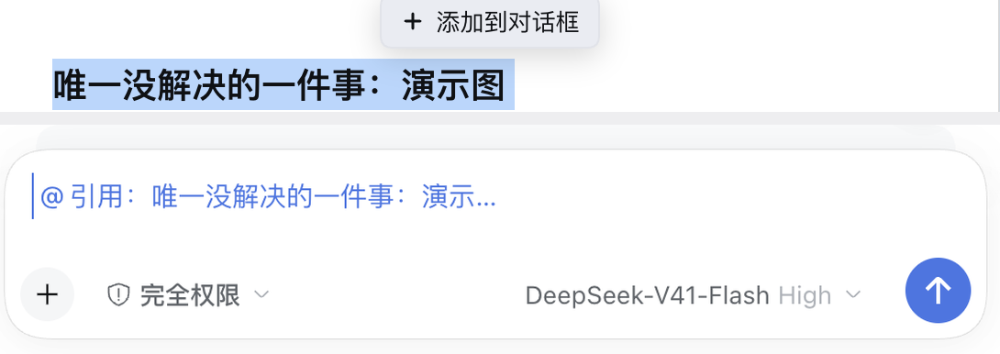

# dsh-selection-quote

[](https://github.com/cfyofjackie/dsh-selection-quote/actions/workflows/ci.yml)

Select a passage in a DSH conversation and put it in the composer as a **quote**
— a removable reference object, not pasted text.

English | [中文](README.md)



```sh
dsh plugin --profile web add github:cfyofjackie/dsh-selection-quote
```

Reload the page once and it is live. Replace `web` with your profile; other ways
to install are [below](#install).

## The problem it solves

ChatGPT and Codex let you select a passage and "add to conversation", so you can
follow up on **one specific sentence** without describing it again — and without
losing track of which part of the message is quotation and which part is you. DSH
has no such action; you copy and paste by hand.

## What it does

1. Select a passage in the transcript (an assistant reply, your own message).
2. A button appears next to the selection: **Add to chat** (「添加到对话框」).
3. Clicking it puts a **quote chip** in the composer, labelled with the start of
   the passage.
4. The chip is an object, not a string:
   - one Backspace removes the whole thing;
   - it undoes in the same step as the typing around it;
   - copying the draft expands it to `> the passage`, readable wherever pasted;
   - **at submit time** it becomes the quote the model sees.
5. Focus returns to the composer; you type your question and send it yourself.

It never sends, never writes storage, and never touches the session log.

## Install

Installing the package without mounting it, or mounting it without the page
reloading, both look exactly like "nothing happened". One `add` does both halves:

```sh
dsh plugin --profile web add github:cfyofjackie/dsh-selection-quote
```

Replace `web` with the profile you want it in, then **reload the page once**.

> ⚠️ Do not try it on `desktop` — that is the profile you are working in. Use the
> isolated sandbox below instead; it touches nothing.

<details>
<summary>Other ways to install</summary>

**Isolated trial** (its own `DSH_HOME`, no contact with your main profile):

```sh
CLI="/Applications/DeepSeek Harness.app/Contents/Resources/runtime/cli/bin/dsh"
export DSH_HOME=/tmp/dsh-sandbox
"$CLI" --profile sandbox --from-default-profile web --dump-config   # create
"$CLI" plugin --profile sandbox add github:cfyofjackie/dsh-selection-quote
"$CLI" --profile sandbox --port 3917                                # boot
```

A fresh `DSH_HOME` has no model credentials: the UI opens and the plugin
registers, but nothing can answer a conversation. To lend it your key, copy
`~/.dsh/.credentials.yaml` into `/tmp/dsh-sandbox/`. (`dsh web` prints an
authenticated URL — open that; the bare port answers 401.)

**No package manager: mount a clone by absolute path** in the profile's
`cordis.patch.yml`:

```yaml
- insert:
    - id: dsh-selection-quote
      name: "/absolute/path/dsh-selection-quote/lib/index.js"
```

A freshly created profile's patch file contains just `[]`; **replace** that line
rather than appending after it, because `[]` followed by a list item is a YAML
parse error and the profile will not boot.

**Once published to npm**, the command matches the official plugins exactly:

```sh
dsh plugin --profile web add dsh-selection-quote
```

</details>

## How it works

The quote rides DSH's own **reference pipeline** — the one `@file` / `@session`
use — rather than splicing a string into the draft. Three projections, three
owners:

| Projection | Produced by | Value |
|---|---|---|
| Text on the chip | `label` at insertion | `引用：the passage…` |
| Clipboard / persisted draft | `codec.clipboardText(ref)` | `> the passage` |
| **What the model receives** | `codec.serialize(ref)` | `> the passage` |

Four decisions carry the design:

- **The package is a profile bundle** (`dsh.bundle.patch` + `cordis.patch.yml`),
  the same shape as the official `@deepseek-ai/dsh-experimental-*-bundle`
  packages — which is why one command installs *and* mounts it, and why the
  plugin manager recognises it.
- **`ref` is self-contained**: the passage is base64url-encoded inside the
  reference id, so resolving it never depends on plugin memory. DSH defines a
  missing codec as **a refused submission**, not a silent downgrade; that is not
  something to gamble on.
- **Insertion uses detect coordinates**: the composer walks its document into two
  projections, and a chip is exactly one character in the detect projection
  versus its full text in the clipboard projection — so "end of document" has to
  be folded across.
- **The plugin ships its own error boundary**, because a slot entry that throws
  once is **silently abdicated**: the loader still reports `active` while the page
  shows nothing at all. Without that boundary none of the other problems would
  have been findable.

Four failures are written up in [docs/gotchas.md](docs/gotchas.md), each with the
source it was traced to.

## Known limitations

- The quote lands at the **end of the document**, not at the caret — the caret is
  not part of the public standard props, whereas the document end is exact.
- If insertion is refused (a stale revision) the quote **falls back to plain
  text**: the passage is not lost, it just stops being a chip.
- One quote is capped at 20 000 characters, truncated with an explicit marker
  rather than silently shortened.
- A quote is **not editable**: it is an atomic node; delete it and select again.
- The button is disabled while the composer is submitting or claimed.
- Chat view only; the trajectory and waterfall views carry no transcript anchors.
- A quote carries **no provenance** (which message it came from).
- UI copy follows DSH's locale (both `zh` and `en` ship) — switching DSH to
  Chinese shows 「添加到对话框」.

## Development

```sh
npm install --no-save esbuild   # the only build tool; DSH's own runtime also works
npm run build                   # writes lib/
npm test                        # build, then the headless suite
```

`npm test` runs the **built bundle**, not the TypeScript source: it stubs the
browser globals and platform-seed modules, renders components with a small hook
runtime that also implements React's error-boundary semantics, and replays real
event orderings. Every regression test corresponds to a failure this plugin has
actually had.

`lib/` is committed, so a checkout needs no build step. CI builds and tests on
ubuntu, windows and macos, and fails when the committed `lib/` no longer matches
the source.

## License

MIT — see [LICENSE](LICENSE). Not affiliated with DeepSeek.
